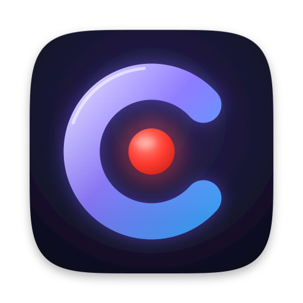

<div align="center">



<h1>Caplo</h1>

<p>macOS 原生录屏与视频编辑工具。录完即进入编辑器，自动镜头、光标美化、画布与字幕处理后导出成片。</p>

<p>
  <a href="https://github.com/icloudza/caplo/releases/latest"></a>
  
  
  
  <a href="LICENSE"></a>
</p>

<p>
  <a href="https://download.caplo.app/Caplo.dmg"></a>
</p>

<p>
  <a href="https://caplo.app">官网</a>
  &nbsp;·&nbsp;
  <a href="https://github.com/icloudza/caplo/releases">版本发布</a>
  &nbsp;·&nbsp;
  <a href="ReleaseNotes">更新说明</a>
</p>

</div>

<br>

## 功能

- **录制**：全屏、自定义区域、单个窗口；同时采集摄像头、麦克风与系统声音，录制浮层不进画面。
- **镜头**：按点击与指针轨迹自动生成聚焦缩放，可在时间线上手动增删、调整。
- **光标**：平滑轨迹、点击效果、多套光标样式与实时玻璃透镜。
- **画布**：原始 / 常用比例与平台预设，背景、边距、圆角、阴影、裁剪。
- **叠加层**：遮罩、文字、标题卡、摄像头人像布局。
- **字幕**：系统语音识别本地转写，可逐条编辑。
- **声音**：降噪、回声消除、逐片段音量；录制声音默认跟随画面，可分离单独编辑。
- **导出**：H.264 / HEVC（MP4）、ProRes 422（MOV）、GIF，最高 4K。
- **更新**：应用内检查、下载并安装新版本，录制与导出期间不打扰。

## 环境

- macOS 15 及以上
- Xcode 16 及以上（Swift 6，严格并发检查）
- 首次运行需授予屏幕录制、摄像头、麦克风权限

## 构建

```bash
cp Config/Local.xcconfig.example Config/Local.xcconfig   # 填写 DEVELOPMENT_TEAM
open Caplo.xcodeproj
```

签名用固定的开发证书，避免每次构建后屏幕录制授权失效。工程由 `project.yml` 生成，修改后执行 `xcodegen generate`。

命令行无签名构建：

```bash
xcodebuild -project Caplo.xcodeproj -scheme Caplo -configuration Debug \
  -destination 'platform=macOS' -derivedDataPath build \
  CODE_SIGNING_ALLOWED=NO CAPLO_APP_IDENTIFIER=com.caplo.buildcheck CAPLO_APP_NAME=CaploBuildCheck build
```

`-derivedDataPath build` 与改名参数用于隔离检查构建，不覆盖日常使用的 Caplo.app。

## 测试

```bash
Scripts/check.sh
```

依次执行：单元测试 → 颜色令牌检查 → 全部窗口实际创建并跑完显示周期 → 无签名构建。单独运行：

```bash
cd Packages/CaploKit
swift test                                              # 单元测试
swift run PreviewGallery ../../build/previews --windows # 窗口回归
swift run PreviewGallery ../../build/previews --demo    # 界面与渲染快照
```

## 发布

推送 `vX.Y.Z` 标签后，GitHub Actions 自动完成签名、公证、制作 DMG、创建 GitHub Release，并上传到 Cloudflare R2，供官网下载和应用内更新（Sparkle）。配置与流程见 [Scripts/release/README.md](Scripts/release/README.md)。

## 结构

```
App/                      应用入口、Info.plist、权限声明
Config/                   xcconfig（本机签名配置不入库）
Packages/CaploKit/
  Sources/
    CaptureKit            ScreenCaptureKit 采集、分段写入、设备会话
    EditingCore           编辑数据模型：时间线、镜头、光标轨迹、画布布局
    RenderKit             Core Image 合成、光标与玻璃渲染、Metal 内核
    ExportKit             播放项组装、导出、转写、语音处理
    ProjectKit            工程包读写与存储
    Features              SwiftUI / AppKit 界面：录制条、编辑器、项目中心、设置
    CaploDesignSystem     颜色、字体、材质令牌与通用控件
    PlatformSupport       系统版本兼容层
    CRNNoise              RNNoise 降噪（C）
    PreviewGallery        快照与窗口回归工具
  Shaders/                Metal 内核源码
Scripts/                  内核编译、资源生成、整体检查、发布（release/）
ReleaseNotes/             各版本更新说明
```

修改 `Shaders/CaploKernels.metal` 后执行 `zsh Scripts/build-kernels.sh` 重新生成 `CaploKernels.metallib`；`LiquidGlass.swift` 中的 CIKL 兜底实现需同步修改。

## 许可证

源码与官网发布的安装包均以 [PolyForm Noncommercial 1.0.0](LICENSE) 授权：允许个人学习、研究、爱好项目以及非营利机构使用、修改和分发；**禁止任何商业用途**，包括在公司或营利性工作中使用、出售，或作为商业产品与服务的一部分。商业授权请联系 cloudza@vip.qq.com。

第三方组件保留各自的许可证：

- [Sparkle](https://github.com/sparkle-project/Sparkle)：MIT，应用内更新，SwiftPM 依赖
- [RNNoise](https://github.com/xiph/rnnoise)：BSD-3-Clause，见 `Packages/CaploKit/Sources/CRNNoise/COPYING`
- [OpenScreen](https://github.com/getopenscreen/openscreen)：MIT，见 `Packages/CaploKit/Sources/RenderKit/Resources/Licenses/OpenScreen.txt`
- [Capptivo](https://github.com/SECHAK-AG/capptivo) 光标素材：MIT，见 `Packages/CaploKit/Sources/RenderKit/Resources/Licenses/Capptivo.txt`
